# CMOS-3-bit-Wallace-Tree-Multiplier

This repository contains the design, test and chracterization of a CMOS 3-bitm Wallace Tree Multiplier designed in Synopsys Custom Compiler using a 28nm PDK.  
This project was done as a part of Analog Hackathon conductued by IITH, Synopsys and VSD.

# Table of Contents
 * [Introduction](#Introduction)
 * [Circuit Details](#Circuit-Details)
 * [Schematic in Synopsys Custom Compiler](#Schematic-in-Synopsys-Custom-Compiler)
 * [Netlist of the Circuit](#Netlist-of-the-Circuit)
 * [Simulation and Results](#Simulation-and-Results)
 * [Author](#Author)
 * [Acknowledgements](#Acknowledgements)
 * [References](#References)

# Introduction

A Wallace multiplier is a hardware
implementation of a binary multiplier, commonly used in
digital computers. It is a digital circuit that multiplies
two integers. It uses multiple AND gates, half and full
adders to sum partial products in stages until two
numbers are left.This is also called the Wallace tree or
Wallace reduction. Wallace multipliers were devised by
the Australian computer scientist Chris Wallace in 1964

# Circuit Details

The Wallace tree has three steps:  
• Multiply each bit of one of the arguments, by each
bit of the other.   
• Reduce the number of partial products to two by
layers of full and half adders.   
• Group the wires in two numbers, and add them with
a conventional adder.   
 First we need to multiply each bit of first factor(A)
by each digit of the other factor(B). Each of this partial
products will have weight equal to the product of its
factors. The final product is calculated by the weighted
sum of all these partial products. Next the resulting bits
are reduced to two numbers, this is done by using a
full adder to sum three components and half adder to
sum two components. Finally the two resulting numbers
are given as input to an adder and the final product is
obtained.  

The Circuit of the 3-bit wallace is as shown in Fig. 1

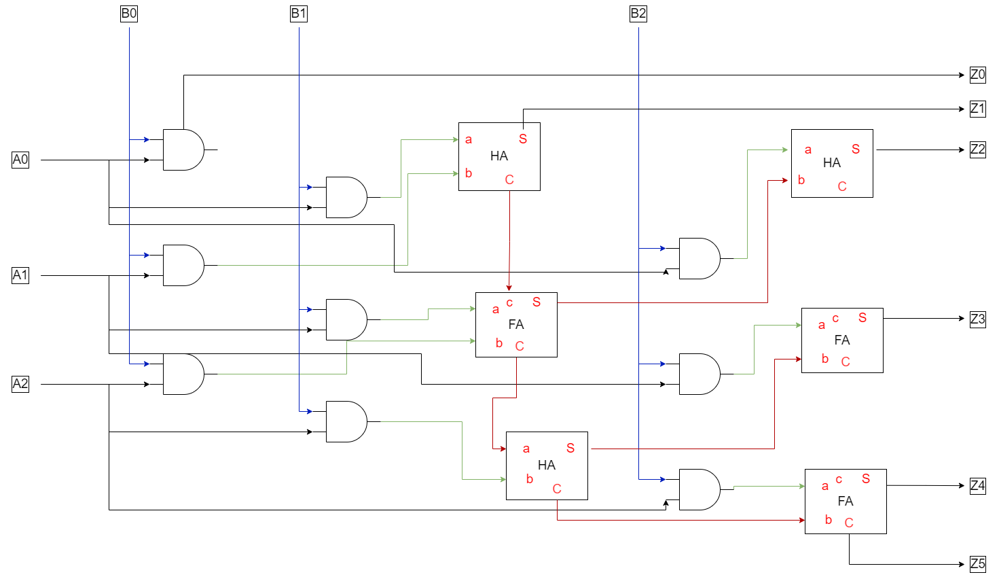 
  Fig. 1: 3-bit Wallace Tree Multiplier

 

We will need the following components for the designing the 3-bit Wallace Tree Multiplier: 
1. AND gate 
2. Half Adder 
3. Full Adder 

 

CMOS circuit of AND gate is shown in Fig. 2.

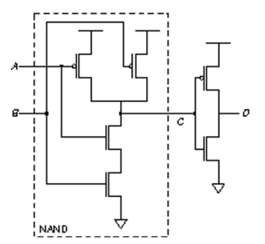 
  Fig. 2: AND gate implemented in CMOS

 

Half adders can be made using XOR gates and AND gates.  XOR gate is implemented here using the NAND gate. 
The CMOS implementation of NAND gate is shown in Fig. 3.

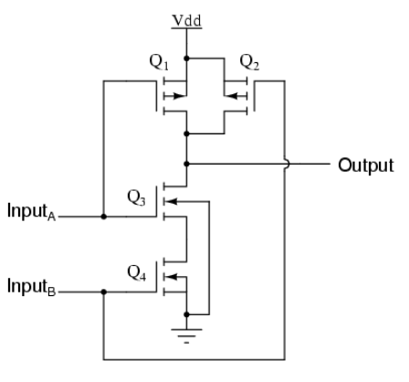 
  Fig. 3: NAND gate implemented in CMOS

 

Implememtation of XOR gate using NAND gate is shown in Fig. 4.

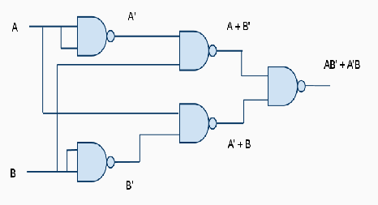 
  Fig. 4: XOR gate implemented from NAND

 

Implememtation of Half adder is shown in Fig. 5.

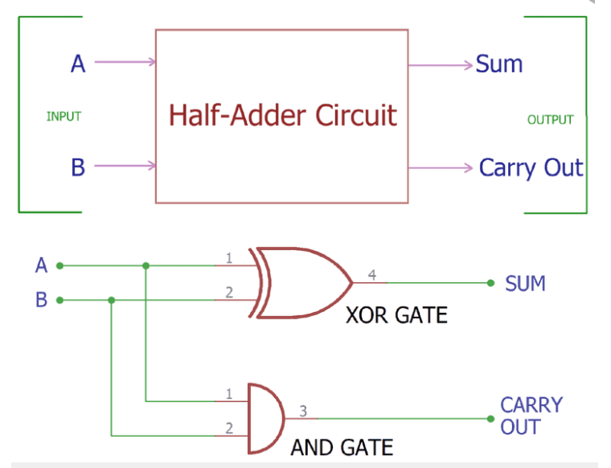 
  Fig. 5: Half Adder Circuit

 

Full adder can be implemented using half adders and or gate as shown in Fig. 6. 

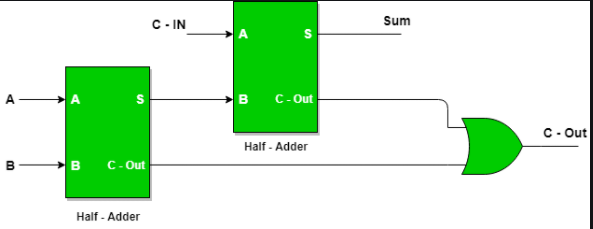 
  Fig. 6: Full Adder Circuit

 

# Schematic in Synopsys Custom Compiler

The schematic of the components as discussed in above section are given below.

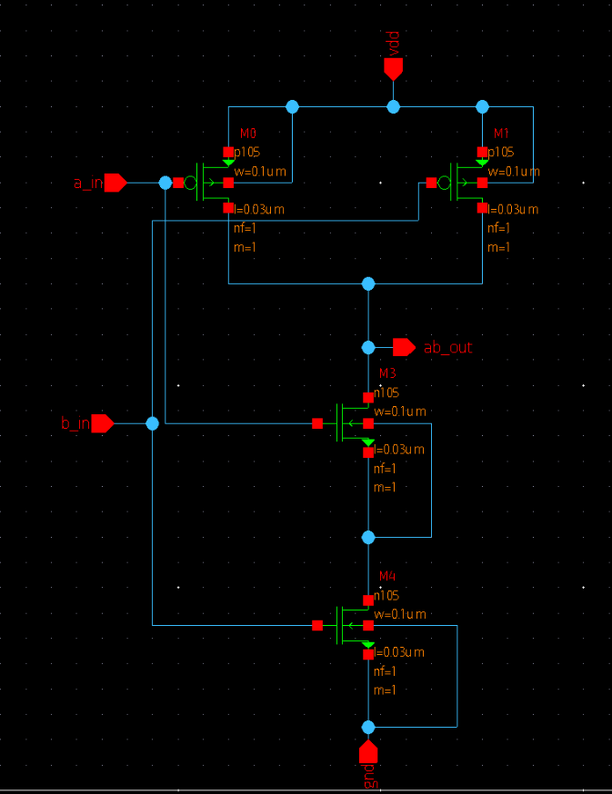 
  Fig. 7: NAND gate

 

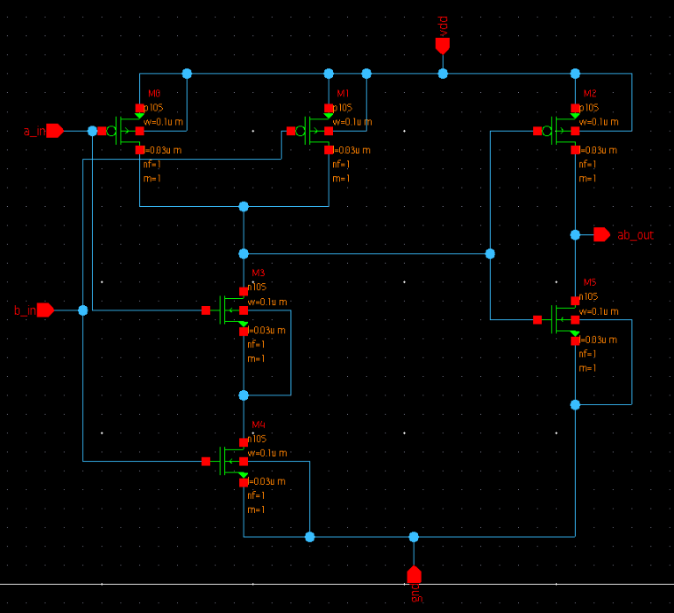 
  Fig. 8: AND gate

 

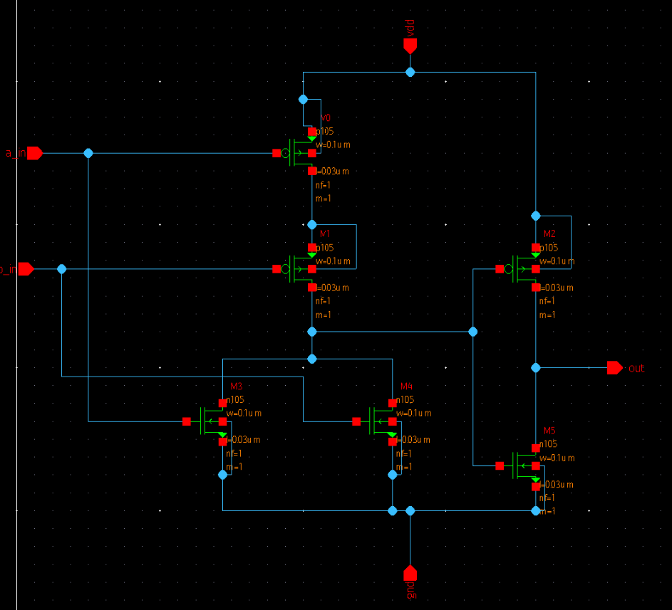 
  Fig. 9: OR gate

 

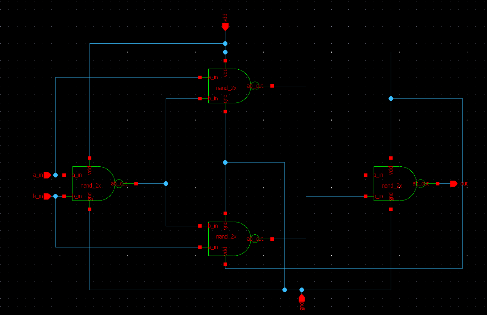 
  Fig. 10: XOR gate

 

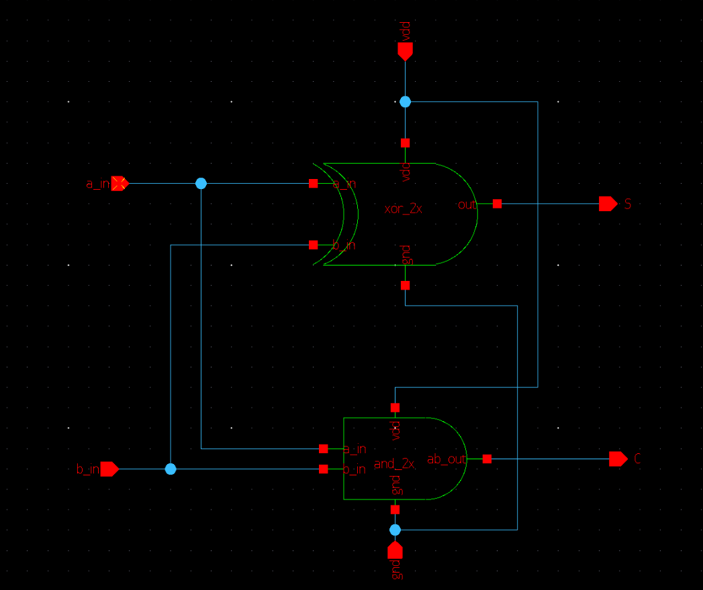 
  Fig. 11: Half Adder Circuit

 

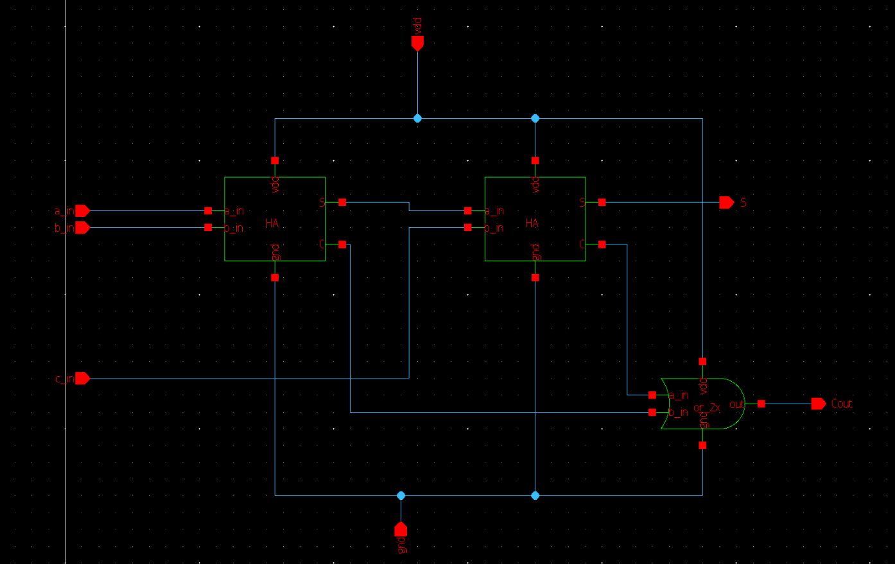 
  Fig. 12: Full Adder Circuit

 

The circuit of the 3-bit wallace tree multiplier is shown in Fig. 13.

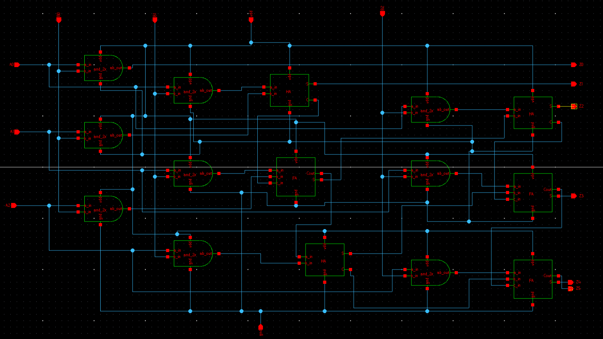 
  Fig. 13: 3-bit Wallace Tree Multiplier

 

# Simulation and Results

The simulation was done in Synopsys Prime Wave tool.  
The simulation setup is shown in Fig. 14. 

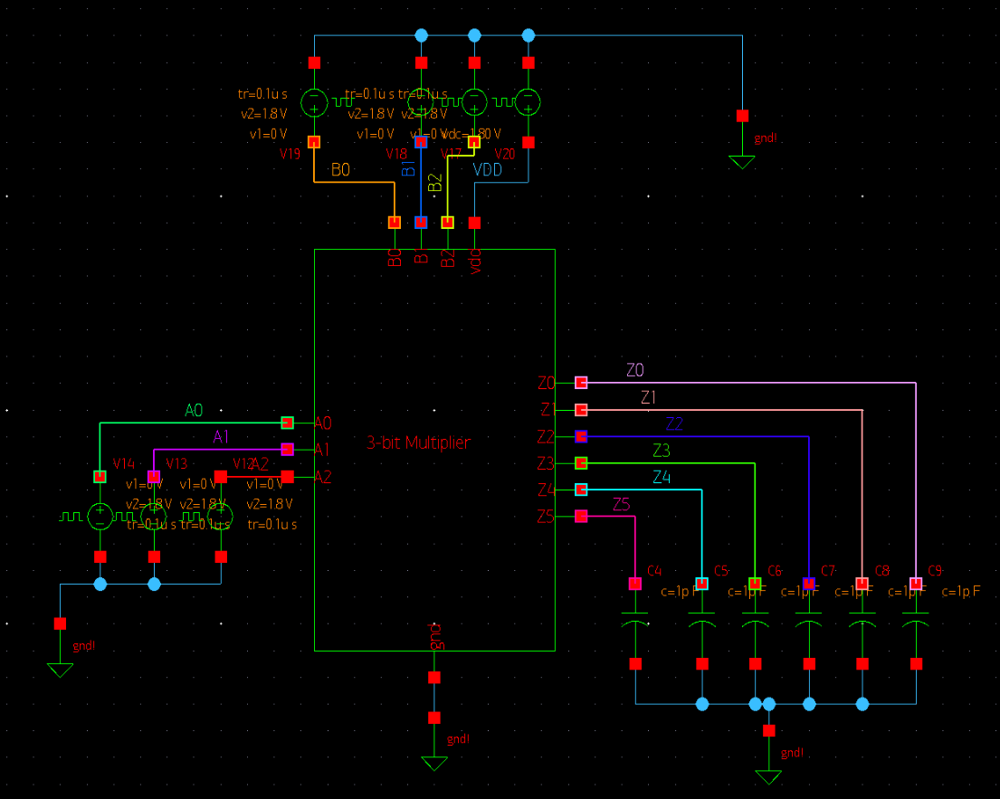 
  Fig. 14: Simulation setup

 

The netlist of the circuit can be accessed  <a href='final_netlist'>here</a>

# Results

The result of the simulation is shown in Fig. 15.  
As we can see it works perfectly as a 3-bit multiplier, for example for A2, A1, A0 as 1, 0, 1 and B2, B1, B0 as 0, 1, 0 we expect the output to be001010(Z5Z4Z3Z2Z1Z0) ans we get that from the waveforms too. Hence verifying our design and circuit.

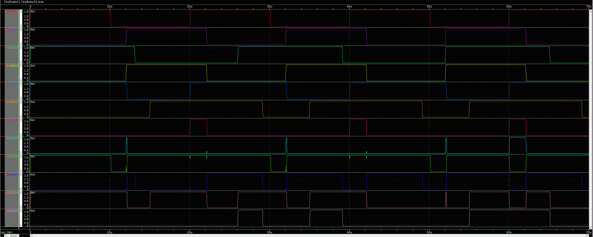 
  Fig. 15: Simulation Result

 

# Author:
• Subham Mohapatra, B.Tech(EEE), National Institute of Technology Karnataka, Surathkal. <a href='https://www.linkedin.com/in/subham-nitk/'>LinkedIn</a> 

# Acknowledgements:
• <a href='https://www.iith.ac.in/events/2022/02/15/Cloud-Based-Analog-IC-Design-Hackathon/'>Cloud Based Analog IC Design Hackathon</a> 
• <a href='https://www.synopsys.com/'>Synopsys India</a> 
• <a href='https://www.vlsisystemdesign.com/'>VLSI System Design (VSD) Corp. Pvt. Ltd India</a> 

# References:
[1] Implementation of a CMOS Wallace-tree Multiplier, Xiaoping
Li, Xingguo Xiong, Hassan Bajwa, Prabir Patra Department of
Electrical and Computer Engineering, University of Bridgeport,
Bridgeport, CT 06604  
[2] N. Sureka, R. Porselvi and K. Kumuthapriya, ”An efficient high
speed Wallace tree multiplier,” 2013 International Conference on
Information Communication and Embedded Systems (ICICES),
2013, pp. 1023-1026, doi: 10.1109/ICICES.2013.6508192
